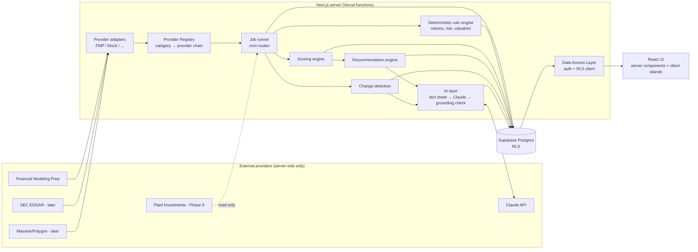

# System Architecture

Personal AI investment research & portfolio intelligence platform. Built for one owner, with invite-only access for a small number of additional users, each with a private portfolio and optional read-only sharing.

**Competitive advantage:** DATA + PERSONALIZATION + CHANGE DETECTION + EXPLAINABLE AI.
**Tie-breakers:** trustworthy calculations > more features; accurate data > sophisticated narrative.

---

## 1. Non-negotiable principles → where they are enforced

| Principle | Enforcement point |
|---|---|
| Never execute trades | No brokerage write scopes are ever requested. The `BrokerageConnector` interface has read methods only. No order tables exist. |
| No LLM-originated financial values | AI layer receives a **Fact Sheet** (typed, IDed facts). Output is validated by the **numeric grounding check** (§7.3); ungrounded numbers are stripped/flagged before display. |
| Every metric from DB/API or deterministic calculation | All metrics live in `financial_metrics` / `valuation_snapshots` / `portfolio_metrics` with `data_kind` + `source_provider`. Calculations are pure TS functions in `src/lib/calc/*` with unit tests. |
| Timestamps & sources visible | Every normalized record carries `Provenance` (`provider`, `as_of`, `fetched_at`, `data_kind`). UI uses `<DataAsOf>` / `<ProvenanceTag>` everywhere a value is shown. |
| Distinguish fact / calculated / estimate / AI / assumption | Postgres enum `data_kind` (`reported`, `provider_derived`, `calculated`, `estimate`, `ai_interpretation`, `scenario_assumption`), mirrored in TS and color-coded in UI. |
| Historical snapshots | Append-only snapshot tables keyed by `(entity, as_of_date)`; nothing is overwritten in place except "latest" convenience views. |
| Recommendations never solely from LLM | `recommendations.rating` is computed by `src/lib/recommend/engine.ts` (deterministic). Claude writes only `narrative` fields. |
| Stale data is dangerous | `data_freshness` view + per-dataset SLAs; stale inputs downgrade recommendation confidence and are surfaced on the Data Health page and next to affected values. |

---

## 2. High-level component diagram



**Key rule:** UI components and scoring/calculation code never import a provider adapter. They read normalized rows from Postgres (via the DAL) or call the registry from a job. ESLint `no-restricted-imports` enforces that `src/lib/providers/fmp/**` is importable only from `src/lib/providers/registry.ts`.

---

## 3. Layered code layout

```
src/
  app/                    Next.js routes (UI + route handlers)
    (auth)/login          magic-link login
    (app)/...             authenticated app shell + pages
    api/cron/*            scheduled jobs (CRON_SECRET-protected)
  proxy.ts                session refresh + auth gate (Next 16 "proxy", formerly middleware)
  components/
    ui/                   shadcn-style primitives
    layout/               sidebar, top bar
    data/                 provenance-aware display (DataAsOf, ProvenanceTag, Money, Pct)
  lib/
    env.ts                zod-validated server env (server-only)
    supabase/             server / browser / admin clients
    auth/                 DAL: requireUser(), single-user allowlist
    domain/               normalized domain types + provenance (provider-agnostic)
    providers/
      interfaces.ts       MarketDataProvider, FundamentalsProvider, EstimatesProvider,
                          CompanyInfoProvider, EventsProvider, NewsProvider, InsiderDataProvider
      registry.ts         resolves providers per category, fallback chains, health
      http.ts             timeout, retry w/ backoff, rate-limit, request logging
      fmp/                FMP implementation (only place FMP endpoints exist)
      mock/               deterministic fixtures for dev & tests
    portfolio/            holdings model, CSV import, brokerage connectors (Plaid optional)
    calc/                 pure deterministic math (Phase 2+)
    scoring/              scoring engine (Phase 3)
    recommend/            recommendation engine (Phase 3)
    changes/              change detection (Phase 7)
    ai/                   fact sheet builder, prompts, grounding check (Phase 5)
    jobs/                 job runner + individual jobs
supabase/migrations/      SQL schema, RLS, functions
docs/                     architecture, scoring, providers, env
```

---

## 4. Data model overview

See `supabase/migrations/*.sql` for the authoritative schema. Groups:

1. **Identity & preferences** — `users`, `investment_profiles` (Investment DNA, versioned), `investment_profile_history`.
2. **Portfolio** — `accounts`, `portfolio_holdings`, `portfolio_transactions`, `brokerage_connections` (encrypted tokens), `import_batches`.
3. **Reference & market data (shared, service-role writes only)** — `companies` (security master incl. ETFs), `security_prices`, `financial_statements`, `financial_metrics`, `valuation_snapshots`, `analyst_estimates`, `analyst_ratings`, `price_targets`, `company_events`, `news_articles`, `news_article_symbols`, `insider_transactions`, `institutional_ownership`, `company_peers`, `company_executives`.
4. **Analytics (per user)** — `portfolio_daily_snapshots`, `portfolio_metrics`, `investment_scores`, `investment_score_components`, `scoring_models`, `recommendations`, `recommendation_history`, `change_events`.
5. **Research workflow** — `watchlists`, `watchlist_members`, `screeners`, `screener_rules`, `screener_runs`, `screener_results`, `journal_entries`, `alerts`, `alert_events`.
6. **AI & planning** — `scenario_runs`, `scenario_results`, `daily_briefs`, `ai_conversations`, `ai_messages`.
7. **Operations** — `job_runs`, `provider_requests`, `dataset_freshness_sla`, `rate_limit_buckets`, view `data_freshness`.

### Provenance columns (on every market/fundamental record)

| column | meaning |
|---|---|
| `source_provider` | `fmp`, `sec_edgar`, `polygon`, `manual`, `calc`, `plaid`, `mock` |
| `source_ref` | provider endpoint / filing accession / calc function name + version |
| `data_kind` | `reported`, `provider_derived`, `calculated`, `estimate`, `ai_interpretation`, `scenario_assumption` |
| `as_of` | the economic date of the value (period end, price date, estimate date) |
| `fetched_at` | when we retrieved it |
| `ingested_job_id` | `job_runs.id` that wrote it (traceability) |

### Snapshot strategy

- Time-series tables are append-only and unique on `(security_id, as_of[, period, metric])`. Re-fetching the same `as_of` updates the row only if values changed and records `revised_at` (restatements are themselves a detectable change).
- Daily derived tables (`portfolio_daily_snapshots`, `investment_scores`, `valuation_snapshots`, `recommendations`) are keyed by `snapshot_date`, enabling **today vs 1d / 7d / 30d** comparison with simple joins.

---

## 5. Provider abstraction

Detailed in `docs/PROVIDERS.md`. Summary:

- Category interfaces with **normalized** return types; every result is `Sourced<T>` (value + provenance).
- `null` means "unavailable" — never coerced to `0`. Mappers reject non-finite numbers.
- Registry is configured per category via env (`PROVIDER_MARKET_DATA=fmp`, later `polygon`; `PROVIDER_FUNDAMENTALS=fmp`, later `sec_edgar,fmp` as a fallback chain).
- **SEC EDGAR as authoritative source (later):** `FundamentalsProvider.getStatements()` results carry `data_kind='reported'` + the filing accession number when sourced from EDGAR. FMP's standardized statements are also stored as `reported`, but with `source_provider='fmp'`, so the UI can show which source a figure came from. When both exist, a reconciliation job compares key line items and flags discrepancies >0.5%.
- **Polygon/Massive (later):** swaps in for `MarketDataProvider` only; fundamentals stay on FMP/EDGAR.

---

## 6. Jobs & refresh pipeline

- Vercel Cron → `GET /api/cron/<job>` with `Authorization: Bearer $CRON_SECRET`.
- `runJob(name, fn)` writes a `job_runs` row (start, finish, status, records_updated, error, per-provider stats).
- Work fans out per symbol with bounded concurrency; each symbol/category is isolated with `Promise.allSettled` so **one provider or symbol failure never fails the whole refresh** (status becomes `partial`).
- Every outbound provider call is recorded in `provider_requests` (failures always; successes sampled) for the Data Health page.
- Daily DAG (Phase 7 fully, Phase 1 implements the first node):
  `prices → profiles → fundamentals → estimates → events/news/insider → valuation calc → scores → portfolio analytics → screeners → change detection → alerts → daily brief → snapshot seal`.
  Later stages check upstream freshness and run in **degraded mode** (with explicit warnings) rather than silently using stale inputs.
- Vercel function limits: long jobs are chunked (cursor in `job_runs.state`) and re-invoked; nothing assumes >60s execution.

---

## 7. AI layer (Phase 5) — explainable, grounded

1. **Deterministic first.** Scores, ratings, portfolio analytics, scenario math are computed before any LLM call.
2. **Fact Sheet.** The server assembles a JSON fact sheet: each fact `{id, label, value, unit, data_kind, source_provider, as_of}`. Missing values are present as `null` with `"Data unavailable"`.
3. **Grounding check.** After Claude responds (structured JSON per section: ANSWER, KEY EVIDENCE, … DATA AS OF), every number in the text is extracted and matched against fact-sheet values (unit- and rounding-aware). Ungrounded numbers are redacted and the response is flagged. Claude is instructed to reference facts by id (`[[f:pe_fwd]]`), which the server renders from the database — so displayed numbers come from Postgres, not from model tokens.
4. **Tool use for retrieval.** "Ask My Portfolio" uses Claude tool calls (`get_holdings`, `get_scores`, `run_scenario`, `run_screen`, …) that hit the DAL; the model never answers from memory.
5. Every AI output is stored (`ai_messages`, `daily_briefs`, `recommendations.narrative`) with the fact-sheet hash and model id, so later diffs can explain what changed.

---

## 8. Change detection (Phase 7, schema in Phase 1)

- Compare today vs t-1, t-7, t-30 for: score (and each component), price, valuation multiples, estimates, rating, filings, insider trades, news count/sentiment, risk metrics, concentration.
- Thresholds are configurable and stored in `change_detection_rules` (defaults in code).
- Output: `change_events` rows `{subject, metric, from, to, window, magnitude, explanation_facts}`. Recommendation changes link to the `change_events` that caused them, enabling messages like *"BUY → WATCH: price +14% while FY+1 EPS est. +2% → valuation score 82 → 67"* — generated from rows, not prose.
- "No portfolio action recommended today" is a first-class outcome.

---

## 9. Rendering & caching

- Next.js 16 App Router, **Cache Components disabled** (all pages are auth-gated, per-request, and freshness must be explicit). Pages are server components that read via the DAL; interactivity lives in small client components.
- Caching is done at the data layer: scheduled jobs materialize results into Postgres. Pages never call providers on request (except an explicit "refresh this ticker" action, rate limited).

---

## 10. Security

- **Auth & access (multi-user, invite-only):** Supabase Auth email magic link. `access_list` (email, role `owner|member`, revoked_at) is the source of truth, enforced in three independent layers: (1) the `before-user-created` auth hook rejects sign-ups not on the list; (2) a RESTRICTIVE RLS policy `has_access()` on every table, so revocation is immediate even for live sessions; (3) `requireUser()` / `requireOwner()` in the DAL. Owners manage access and see Data Health/job logs; members only ever see their own data plus portfolios explicitly shared with them (`portfolio_shares`, read-only, optionally including transactions). Owners cannot see members' portfolios unless shared. The last owner cannot be revoked or demoted (trigger).
- **RLS on every table.** User-owned tables: `user_id = auth.uid()`. Shared reference data: `select` for `authenticated`, no write policies (only the service-role key used by jobs can write).
- **Secrets:** only in server env; `src/lib/env.ts` imports `server-only`. Only `NEXT_PUBLIC_SUPABASE_URL` and the publishable (anon) key reach the browser.
- **Encrypted credentials:** Plaid access tokens stored AES-256-GCM encrypted with `CREDENTIALS_ENCRYPTION_KEY` (app-level), never returned to the client.
- **Rate limiting:** Postgres-backed token bucket (`rate_limit_hit()` function) for AI and on-demand refresh endpoints — works across serverless instances.
- **Input validation:** zod on every server action / route handler; CSV import validated row-by-row with a preview before commit.
- **Logging:** structured server logs + `job_runs` / `provider_requests`; secrets redacted (`apikey=` stripped from logged URLs).
- **Headers:** HSTS, nosniff, frame-deny, strict referrer policy (see `next.config.ts`).
